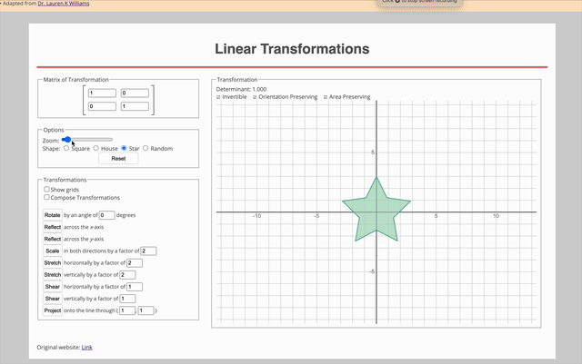

# Linear Transformations



## Link: [https://linear-transformations.netlify.app//](https://linear-transformations.netlify.app/)
[](https://app.netlify.com/sites/linear-transformations/deploys)

This is an interactive webapp for visualizing basic linear transformations. Based on Dr. Lauren K Williams' amazing [JavaScript Applets](https://integral-domain.org/lwilliams/Applets/algebra/linearTransformations.php), this adds a bit more of tweak and modifications for the personal use and experimentations.

- More functionalities (e.g., random shape and cascading transformations) were added in addition to Dr. Lauren's original web app
- Code were bundled using Vite

# Run
```bash
npm run dev
npm run build
npm run preview
```

# See
- For applets: [https://integral-domain.org/lwilliams/Applets/index.php](https://integral-domain.org/lwilliams/Applets/index.php)
- For linear transformations: [https://integral-domain.org/lwilliams/Applets/algebra/linearTransformations.php](https://integral-domain.org/lwilliams/Applets/algebra/linearTransformations.php)

---
- 2020-05-01 jkang first created
- 2024-10-24 
    - heroku app no longer supported
    - npm package reset
    - bundled by Vite
    - deployed via netlify
    - note
        - in html, the src for the js files should include "src/" as a prefix for netlify deployment
        - otherwise, ignore it when locally hosting and testing
        - in dist/, js files are manually added to prevent `npm run build` failing